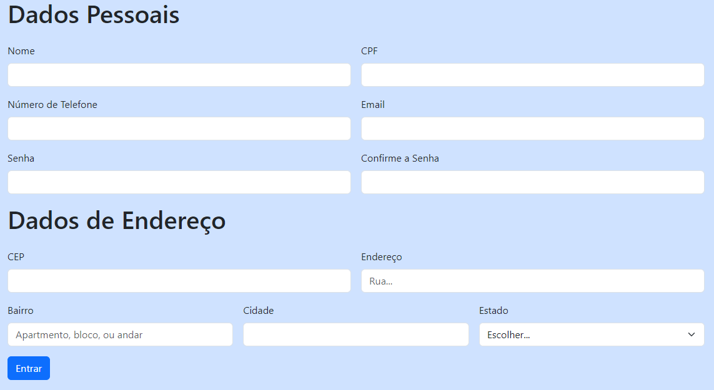

# indice

* [Form cadEcommerce](#form-cadEcommerce)
* [Descrição](#descrição)
* [Introdução](#introdução)
* [Sites Consultados](#sites-consultadoss)
* [Tecnologias Utilidades](#tecnologias-utilizadas)
* [Fontes Consultadas](#fontes-consultadas)
* [Autores](#autores)

# Formulário Cadastro Ecommerce

## Descrição 📖
- Este projeto consiste na criação de um site de cadastro de clientes, inspirado em elementos encontrados em três sites de e-commerce. O site permite aos usuários fornecer informações essenciais, como nome, endereço e detalhes de contato, simplificando o processo de registro. Este trabalho destina-se a demonstrar nossas habilidades em HTML e nossa capacidade de sintetizar informações de várias fontes para desenvolver uma solução única.

## Introdução ✉️
- Preenchimento de dados em um formulário de contatos

## Sites Consultados 🧠
- Os sites explorados nessa pesquisa foram:
- [Shopee](https://shopee.com.br)
- [Renner](https://www.lojasrenner.com.br)
- [Amazon](https://www.amazon.com.br)
- Todos em busca de inspiração e variedade, que possiblitaram na criação do nosso próprio Formulário de Ecommerce

## Tecnologias Utilizadas 🖥️  
- Visual Studio Code;
- CSS3;
- HTML5;
- Bootstrap;
- Github;

## Fontes Consultadas 🔗
- [Bootstrap 5](https://getbootstrap.com/)

## Autores 👥
- [João Pedro Gonçalves](https://github.com/s-pedro13)
- [Nicolas Tonassi](https://github.com/nicolas-tonassi)